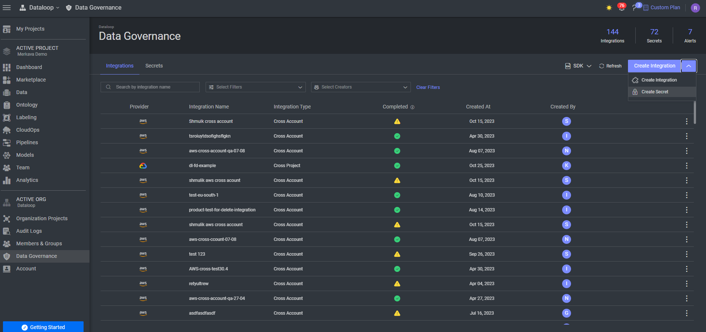

# OpenAI Adapters

This repository contains code for integrating `OpenAI` models into the `Dataloop` platform using direct API access.

## Using OpenAI Models in Dataloop Platform

1. Create an API key for using OpenAI client.
2. Install the model from [Dataloop Marketplace](https://docs.dataloop.ai/docs/marketplace) ( you can filter the
   available models by their provider) :

3. Insert you API key as an `Secret` in Dataloop plat-rom under the name `OPENAI_API_KEY`:

* Navigate to Data Governance in the left option dialog.

* Choose `Create Secret`:

* Insert you API Key and save:

4. When using your model, insert your key to the service:
* Click on `Set Up Secrets`:

* Search for `OPENAI_API_KEY` and choose your `secret` and save.

# Adapters

## Whisper

- [Chat Completion](adapters/chat_completion/README.md)

## Chat Completion

- [Whisper](adapters/whisper/README.md)