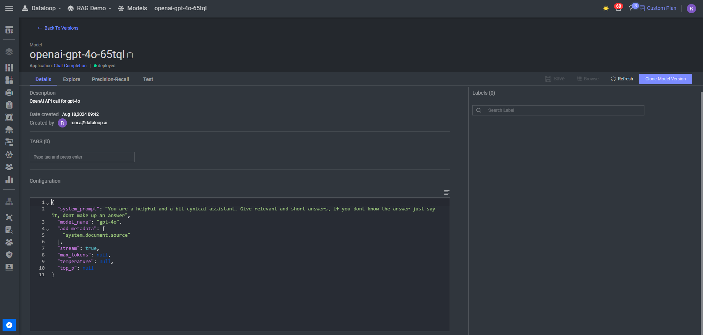

# Chat Completion Adapter

This Adapter is for integrating OpenAI Chat Completion Models in `Dataloop` platform.

For more information on the
models: [OpenAI - Chat Completion](https://platform.openai.com/docs/guides/chat-completions/getting-started
)

* Model's default configuration:

          "model_name": "gpt-4o",
          "add_metadata": [
            "system.document.source"
          ],
          "stream": true,
          "max_tokens": null,
          "temperature": null,
          "top_p": null
        },

    * `model_name` : OpenAI Model's name to get response from. Only chat completion models can be used with this
      adapter.
    * `add_metadata`: For RAG usage, the source for building the context in the item's metadata.
    * `stream`: Enable streaming responses from the model.
    * `max_tokens`: Maximum number of tokens that the model can generate in the response.
    * `temeparture`: Controls the randomness of the model's output. lower values (close to 0) make the output more
      deterministic and higher values (closer to 1) introduce more randomness and creativity in the responses.
    * `top_p`: When generating text, the model considers only the most likely tokens whose cumulative probability adds
      up to this value.

You can customize the configuration from SDK:

    import dtlpy as dl

    model = dl.models.get(model_id="<your-model-id>")
    model.configuration["max_tokens"] = <new value>
    model.update()

From the platform:

Go to the model's page and edit the default configuration.

