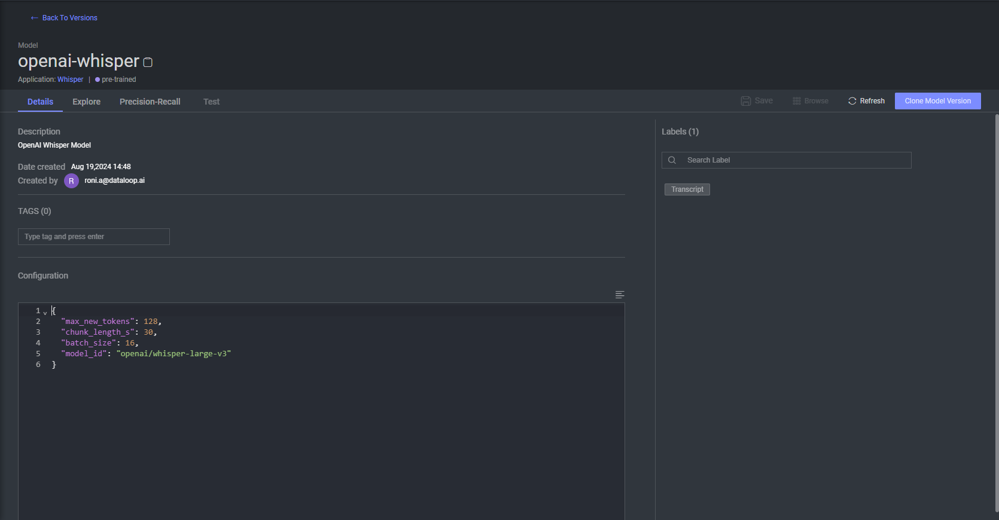

# Whisper Adapter

This Adapter is for integrating Whisper OpenAI Model in `Dataloop` platform.

Whisper by OpenAI is a speech recognition model designed to transcribe spoken language into text.
For more information: [OpenAI - Whisper](https://openai.com/index/whisper/)

* Model's default configuration:

        "configuration": {
          "max_new_tokens": 128,
          "chunk_length_s": 30,
          "batch_size": 16,
          "model_id": "openai/whisper-large-v3"
        }

    * `model_id` : OpenAI Model's id to get response from.
    * `max_new_tokens`: Maximum number of new tokens that the model can generate in response.
    * `chunk_length_s`: The length of each audio chunk, in seconds, that the model processes at a time. 
    * `batch_size`: the number of audio chunks that are processed simultaneously during a single forward pass of the model.

You can customize the configuration from SDK:

    import dtlpy as dl

    model = dl.models.get(model_id="<your-model-id>")
    model.configuration["max_new_tokens"] = <new value>
    model.update()

From the platform:

Go to the model's page and edit the default configuration.

